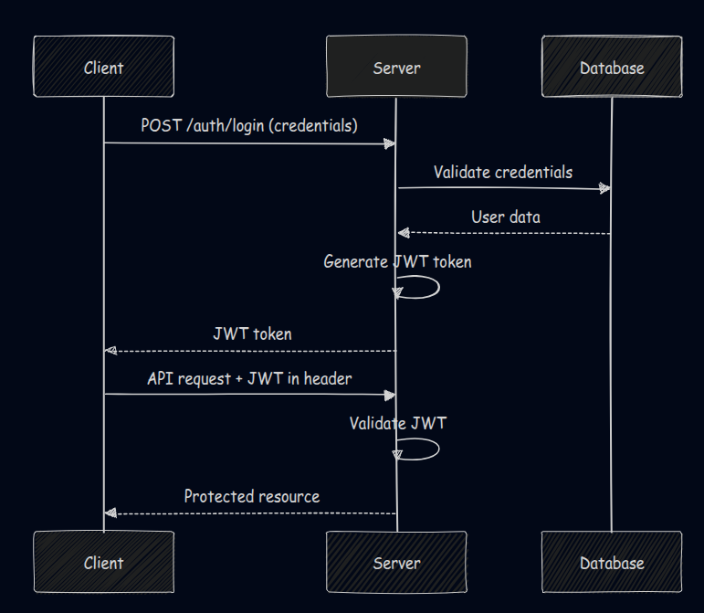

# 🔐 Spring Security JWT Authentication and Authorization System

<div align="center">


[](https://github.com/yourusername/spring-security-jwt)
[](LICENSE)
[](https://github.com/yourusername/spring-security-jwt/releases)
[](https://sonarcloud.io/dashboard?id=your-project)

</div>

---

## 🚀 What's This All About?

Welcome to my **Spring Security JWT Authentication System** – one-stop solution for implementing robust, stateless authentication in Spring Boot applications! 🎯

This project demonstrates a production-ready implementation of JWT (JSON Web Tokens) authentication using Spring Security 6, complete with user registration, login, role-based access control, and secure API endpoints. Whether you're building a RESTful API, microservices, or a full-stack application, this template has got you covered!

### Key Features

- 🛡️ **Enterprise-Grade Security**: Implements industry best practices for authentication and authorization
- 🔄 **Stateless Authentication**: Perfect for microservices and scalable applications
- 🎭 **Role-Based Access Control**: Flexible permission system for different user types
- 🚀 **Production Ready**: Includes error handling, validation, and security configurations
- 📚 **Well Documented**: Comprehensive documentation and examples

---

## 🛠️ Tech Stack & Arsenal

Technology stack that ensures robust performance and maintainability:

### Core Technologies
- **☕ Java 21** - Latest LTS version with modern language features
- **🍃 Spring Boot 3.4.1** - Rapid application development framework
- **🔒 Spring Security 6** - Comprehensive security framework
- **🎫 JWT (JSON Web Tokens)** - Stateless authentication mechanism
- **🗄️ Spring Data JPA** - Data persistence abstraction layer

### Database & Storage

[//]: # (- **🐬 MySQL 8.0+** - Reliable relational database)
- **🐘 PostgreSQL 15+** - Alternative relational database for flexibility
- **💾 H2 Database** - In-memory database for testing

### Additional Libraries

[//]: # (- **📊 Spring Boot Actuator** - Application monitoring and metrics)
- **📝 Spring Boot Validation** - Request validation
- **🧪 JUnit 5** - Unit and integration testing
- **📖 SpringDoc OpenAPI** - API documentation

---

## 🗂️ Project Architecture & Structure

```
src/
├── 📁 main/
│   ├── 📁 java/com/learning/security/
│   │   ├── 📁 auth/                          # Entry point for authentication
│   │   │   ├── AuthEntryPointJwt.java
│   │   │   ├── AuthTokenFilter.java
│   │   │   └── JwtAccessDeniedHandler.java
│   │   ├── 📁 configs/                       # Security & JWT configuration
│   │   │   ├── WebSecurityConfig.java
│   │   │   └── SwaggerConfig.java
│   │   ├── 📁 controllers/                   # REST API endpoints
│   │   │   ├── AuthController.java
│   │   │   ├── Greet.java
│   │   │   └── TestController.java
│   │   ├── 📁 dtos/                          # Data Transfer Objects
│   │   │   ├── LoginRequest.java
│   │   │   ├── SignUpRequest.java
│   │   │   ├── ResponseMessage.java
│   │   │   └── JwtResponse.java
│   │   ├── 📁 enums/                        # JPA Entities
│   │   │   └── ERole.java
│   │   │   📁 exception/                    # Custom exceptions
│   │   │   ├── GlobalExceptionHandler.java
│   │   │   └── CustomJwtException.java
│   │   ├── 📁 models/                       # JPA Entities
│   │   │   ├── User.java
│   │   │   └── Role.java
│   │   ├── 📁 repos/                       # Data access layer
│   │   │   ├── UserRepo.java
│   │   │   └── RoleRepo.java
│   │   ├── 📁 services/                   # Business logic
│   │   │   ├── UserDetailsImpl.java
│   │   │   └── UserDetailsServiceImpl.java
│   │   ├── 📁 utils/                      # Utility classes
│   │   │   └── JwtUtils.java
│   │   └── SecurityApplication.java
│   └── 📁 resources/
│       └── application.yml
└── 📁 test/                    # Test cases
    └── pending...
```

---

## 🎓 Understanding the Magic Behind JWT

### What Exactly is JWT? 🤔

**JWT (JSON Web Token)** is like a digital passport for your application! It's a compact, URL-safe token that represents claims between two parties. Think of it as a secure way to say "Hey, this user is who they claim to be, and here's what they're allowed to do." Now it's responsibility of the server to verify and trust that claim.

### 🏗️ JWT Structure Breakdown

A JWT consists of three parts separated by dots (`.`):

```
xxxxx.yyyyy.zzzzz
```

1. **Header** 📋: Contains token type and signing algorithm
2. **Payload** 📦: Contains the claims (user data, permissions, expiration)
3. **Signature** ✍️: Ensures the token hasn't been tampered with

### 🔄 How JWT Authentication Works


### ✅ Why JWT Rocks for Modern Applications

- **🚀 Stateless**: No server-side session storage needed
- **📈 Scalable**: Perfect for distributed systems
- **🔒 Secure**: Cryptographically signed
- **💾 Self-contained**: All necessary info is in the token
- **🌐 Cross-domain**: Works across different domains

---

## 🚀 Getting Started: Your Journey Begins Here

### 📋 Prerequisites

Before diving in, make sure you have:

- ☕ **Java 17 or higher** installed
- 🛠️ **Maven 3.6+** for dependency management
- 🐘 **PostgreSQL** running locally or remotely

[//]: # (- 🐬 **MySQL 8.0+** running locally or remotely)
- 🔧 **Your favorite IDE** (IntelliJ IDEA, Eclipse, or VS Code)

### 🏃‍♂️ Quick Start Guide

1. **Clone the Repository**
   ```bash
   git clone https://github.com/yousuf-git/Spring_Security_JWT.git
   cd Spring_Security_JWT
   ```

2. **Configure Database**
   ```yaml
   # application.yml
   spring:
     datasource:
       url: jdbc:mysql://localhost:3306/<db_name>
       username: your_username
       password: your_password
   ```

3. **Install Dependencies**
   ```bash
   mvn clean install
   ```

4. **Run the Application**
   ```bash
   mvn spring-boot:run
   ```

5. **Verify Everything Works**
   ```bash
   curl http://localhost:8080/api/greet
   ```

---

## 🎮 API Playground: Let's Test Drive!

Simply open swagger docs via browser and explore the API endpoints:

```bash
# Open Swagger UI
http://localhost:8080/api/swagger-ui/index.html
````

---

## ⚙️ Configuration Deep Dive

### 🔧 JWT Configuration

```yaml
app:
  jwt:
    secret: mySecretKey
    expiration: 86400000  # 24 hours in milliseconds
    refresh-expiration: 604800000  # 7 days
```

### 🛡️ Security Configuration Highlights

- **Password Encoding**: BCrypt with default strength 10
- **CORS**: Configured for cross-origin requests
- **CSRF**: Disabled for stateless authentication
- **Session Management**: Stateless session creation policy

### 🗄️ Database Configuration

```yaml
spring:
  jpa:
    hibernate:
      ddl-auto: update
    show-sql: false
    properties:
      hibernate:
        dialect: org.hibernate.dialect.MySQL8Dialect
        format_sql: true
```

---

## 🧪 Testing Strategy

### 🔬 Unit Tests - Pending...
- Service layer testing with Mockito
- JWT token generation and validation
- Password encoding verification

### 🌐 Integration Tests - Pending...
- Full authentication flow testing
- API endpoint security testing
- Database integration testing

### 🚀 Running Tests

```bash
# Run all tests
mvn test

# Run specific test class
mvn test -Dtest=AuthControllerTest

# Run tests with coverage
mvn test jacoco:report
```

---

## 🔒 Security Best Practices Implemented

### 🛡️ Authentication Security
- ✅ Strong password requirements
- ✅ Account lockout after failed attempts - (pending)
- ✅ JWT token expiration
- ✅ Secure password hashing (BCrypt)

### 🔐 API Security
- ✅ HTTPS enforcement in production
- ✅ Input validation and sanitization
- ✅ SQL injection prevention
- ✅ XSS protection headers

### 📊 Monitoring & Logging - Pending...
- ✅ Security event logging
- ✅ Failed authentication tracking
- ✅ Performance monitoring with Actuator

---

[//]: # (## 🚀 Production Deployment)


## 🐳 Docker Support

### Build the Docker image
```bash
docker build -t jwt_auth_app .
```

### ☁️ Run with environment variables
```bash
docker run -p 8080:8080 \
-e SPRING_ACTIVE_PROFILES=prod
-e DATABASE_URL="jdbc:postgresql://host.docker.internal:5432/auth_db" \
-e DATABASE_USERNAME="<username>" \
-e DATABASE_PASSWORD="<pass>" \
-e JWT_SECRET="<secret>" \
-e JWT_EXPIRATION="86400000" \
jwt_auth_app
```

### Using docker-compose
```bash 
docker-compose up --build
```

---

## 🤝 Contributing & Support

### 🛠️ How to Contribute

1. Fork the repository
2. Create a feature branch (`git checkout -b feature/amazing-feature`)
3. Commit your changes (`git commit -m 'Add amazing feature'`)
4. Push to the branch (`git push origin feature/amazing-feature`)
5. Open a Pull Request

### 📞 Need Help?

- 🐛 **Found a bug?** [Open an issue](https://github.com/yousuf-git/Spring_Security_JWT/issues)
- 💡 **Have a suggestion?** [Start a discussion](https://github.com/yousuf-git/Spring_Security_JWT/discussions)
- 📧 **Email support**: yousuf.work09@example.com

---

### ❤️ Special Thanks

- Spring Security team for the amazing framework
- JWT.io for excellent documentation
- The open-source community for inspiration

---

<div align="center">

**⭐ If this project helped you, please give it a star! ⭐**

Made with ❤️ by [M. Yousuf](https://github.com/yousuf-git)

[](https://github.com/yousuf-git)
[](https://www.linkedin.com/in/muhammad-yousuf952)

</div>

